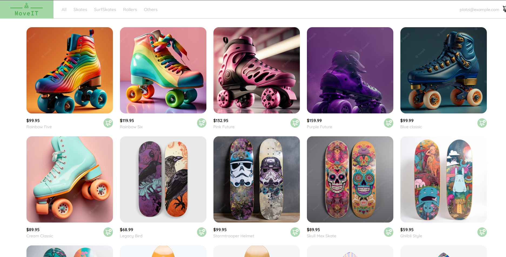
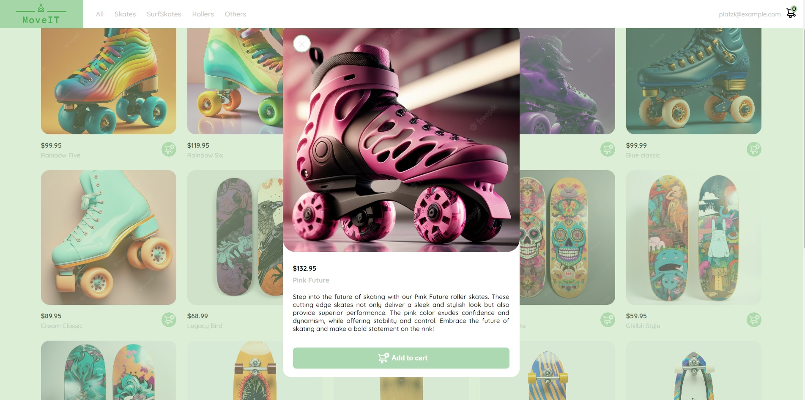
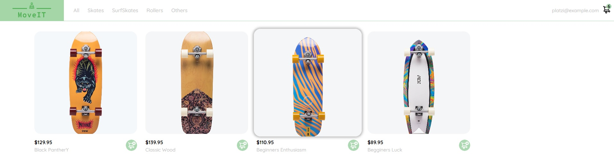

# E-commerce User Interface - LINK: https://mgn3.github.io/project-frontend-developer-js/

Made with:

- HTML5
- CSS3
- Vanilla JavaScript

This webpage is a modified version of the basic template given in the Platzi "Practical JavasScript Course".
The main point is learning the different ways to manipulate the DOM with JavaScript . I made several changes to the template, specially in the JavaScript file that creates cards, modals, events and more. The CSS part was also an interesting challenge, where many different components are interconnected and the complexity was surprising.

## Conclussions
Since this was my first approach to JavaScript I think I have learned many things that make this language so powerfull and ready to go. However, I felt a bit overwhelmed by the lack of a more structured design pattern or a basic class structure as a basic way to do things in other languages I know like Java and C#.
There are many things I have to learned about Front-end and I get the feeling that it's complexity is greater than what is usually believed.

## Screenshots:
### Main view
The header allows filtering by product type. It also contains the cart summary and an account button.
An array of products converted into individual cards.

### Modals
Every product hast it's own modal card. 

### Details
THis screenshot shows the SurfSkate category and the hover effect in the card. The cart icon on the top right shows the amount of products added.

