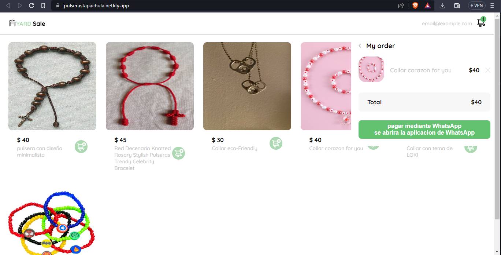

# 🛒 Project-Store-online 🌐
Bienvenido a Kpaez

Pagina web oficial [Kpaez](https://alejandropaez1.github.io/Project-Store-online-/).

Este es el sitio web oficial de STORE KPAEZ, donde podrás encontrar una gran variedad de productos de alta calidad a precios competitivos. Nos esforzamos por brindar una experiencia de compra en línea excepcional, con un servicio al cliente amable y eficiente.
altamente responsivo para ser comodo en todos las pantallas

## Navegación
El sitio cuenta con las siguientes secciones principales:

- Catálogo: Descubre nuestra amplia variedad de productos organizados por categorías.
- Mi Cuenta: Aquí podrás crear una cuenta de usuario, ver tu historial de compras, actualizar tus datos personales y revisar el estado de tus pedidos.
- Carrito: Revisa los productos que has agregado al carrito y continúa con el proceso de compra.
## Tecnologías utilizadas
### Este sitio web ha sido creado utilizando las siguientes tecnologías:
- Tecnologia WebPack Minificación y compresión de archivos: Webpack puede minimizar y comprimir los archivos CSS, JS y HTML de su aplicación web para que se carguen más rápido.

- Carga de imágenes y archivos: Webpack puede cargar imágenes, archivos y otros recursos de manera eficiente para garantizar una carga rápida de la página.

- JavaScript

¡Gracias por visitarnos! Esperamos que disfrutes de tu experiencia de compra en línea con Kpaez.
